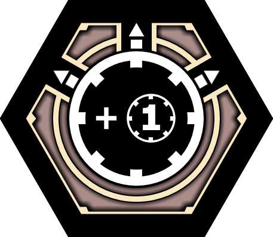

# HELL HOUNDS - version G

## Download

[PDF with tiles](tiles.pdf)

## Tiles

### HQ
* HQ (*Sztab*) x1 - Ability: Swap

### Units
* Tamer (*Hodowca*) x1 - Int3, Ranged x1

* Trainer (*Trener*) x2 - Int2, Ranged x1, Armor, Toughness

* Tugger (*Ciągacz*) x1 - Int3, Melee x1, Armor x2, Mobility, Tugging

* Beast (*Bestia*) x1 - Int1, Melee x1, Net in one direction

* Brute (*Brutus*) x3 - Int2, 2S Melee x1, Melee x2

* Mutant (*Mutant*) x1 - Int1, 3S Melee x1, Toughness

* Shadow (*Cień*) x2 - Int2, Melee x1, Armor x2, Toughness

* Wolf (*Wilk*) x2 - Int2, Melee x1, Toughness

* Cracker (*Petarda*) x2 - Int3, Melee x1

### Modules
* Cage (*Klatka*) x1 - -1 initiative x6

* Bitch (*Suka*) x1 - Swap x6

* Medic (*Medyk*) x2 - Medic x3

* Food (*Karma*) x2 - +1 melee x3

* Speed (*Speed*) x2 - +1 initiative x3

### Instant tiles
* Push Back (*Odepchnięcie*) x1

* Battle (*Bitwa*) x6

* Move (*Ruch*) x3

* Tug (*Ciąganie*) x1

## Skills

### Swap
The main ability of the army is the Swap ability. All friendly units surrounding the Hell Hounds HQ and the Bitch module are in the so-called Swap Zone, meaning that they are eligible for being swapped.

Once per turn, the Hell Hounds player may swap a single board tile from the Swap Zone with one board tile from their hand. The old tile ends up on the player's hand without any kind of markers (damage, venom, etc.). The newly placed tile may be rotated in any way.

If the HQ or Bitch are under a Net, then they no longer spread the Swap Zone. A unit placed under a Net cannot be Swapped.

If a Bitch module is under the influence of a Scoper or Agitator, the opposing player becomes capable of Swapping their own units, too.

A unit with a Spy ability connected to the Hell Hounds HQ or the Bitch module becomes swappable.

In team play, allied players may also make use of the Hell Hounds Swap Zone, but they may only Swap their own tiles, not those belonging to other players.

#### Example

Hell Hounds' turn. The Hell Hounds player draws two Battles and one Food module. There is already one Speed module and a damaged Mutant on the board which currently has no chance of damaging the Borgo HQ, since it will be killed in Initiative 2.

The Swap Zone is marked by the colored spaces.

Since the Mutant is in the Swap Zone, the Hell Hounds player may use the Swap ability to take the Mutant back on their hand and play the Food module in its place. (The damage counter is discarded.)

The Hell Hounds player may now normally play the Mutant tile from their hand, discard one Battle tile, and start a Battle with the other tile. The Borgo HQ will receive 4 damage in Initiative 2.

### Tugging
The supporting ability of the army is the Tugging ability. Tugging is a skill that is used similarly to Push Back: there is a tugging unit and the tugged unit, which must be adjacent.

The tugging unit first moves away from the tugged unit, as if it was pushed back from it, but it may rotate freely in the process. (If the tugging unit is unable to do so, then Tugging may not be used.) Then the tugged unit moves into the space that was previously occupied by the tugging unit, and it may rotate freely in the process.

The tugging unit must be a Hell Hounds unit, but the tugged unit may be any unit on the board. Foundation tiles cannot be Tugged.

Tugging may not be used if the tugging or the tugged unit are under a Net.

The Tugger is a unit with an innate Tugging skill, which may be used once per turn. The Tug instant tile allows the Hell Hounds player to perform Tugging once with any unit.

#### Example

Hell Hounds' turn.

The Tugger is currently next to two tiles: the Outpost HQ and an Outpost Commando. The Hell Hounds player decides to Tug on the Commando, which is possible, because there is a possibility (marked by the colored spaces) for the Tugger to move away from the Commando.

The Hell Hounds player decides to use the Tugging skill on the Tugger and the Commando. The first step is to move the Tugger away from the Commando and to rotate it in any way; the Hell Hounds player uses that to rotate the Tugger in a way which will shield it from the Commando if it decides to aim at it.

Next, the Outpost player must move the Command into the space that was previously occupied by the Tugger. Since the Outpost player may now rotate the Commando in any way, they decide to aim at the neighboring space next to the HQ (since aiming it at the Tugger's armor is pointless).

## Contact
* Mail: `phoe@disroot.org`
* Discord: `phoe#6236`
